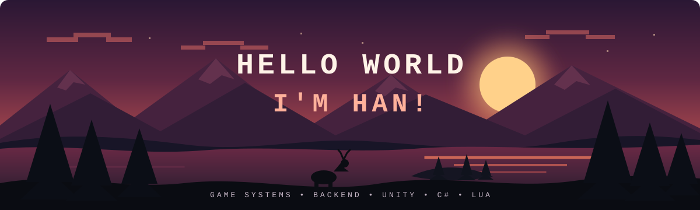

 

### Game Systems Developer • Backend • Unity

I build **MMORPG systems, server-side features, gameplay mechanics and tools**.

---

### Tech Stack

---

### What I Work On

<table>
<tr>
<td width="50%" valign="top">

**MMORPG Systems**

Combat • Skills • PvP  
Progression • Maps • NPCs  
Events • Rewards

</td>
<td width="50%" valign="top">

**Game Backend**

Server Logic • Economy  
Auction • Mail • Guild  
Family • Social Systems

</td>
</tr>
</table>

---

### GitHub Stats

---

`BUILD` • `BREAK` • `IMPROVE`

